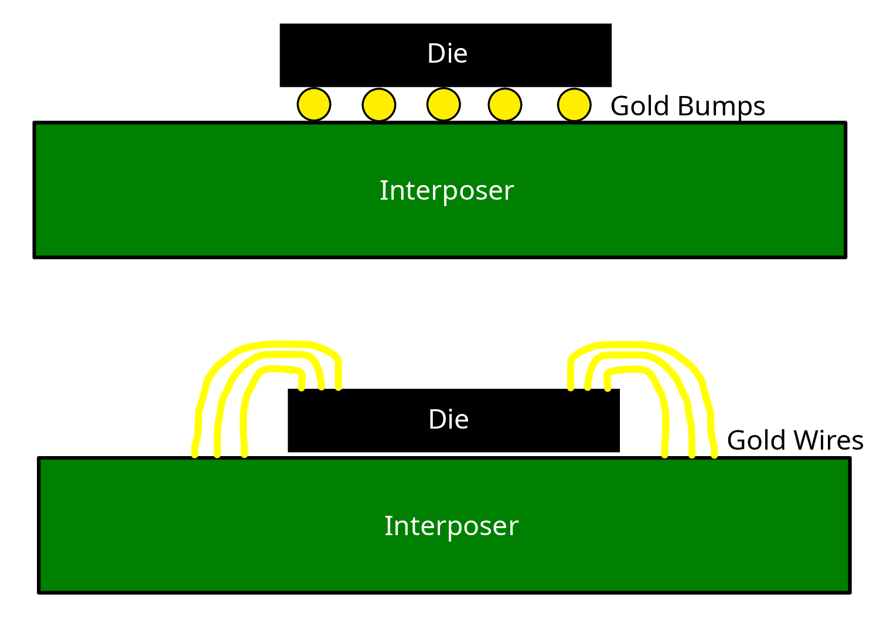
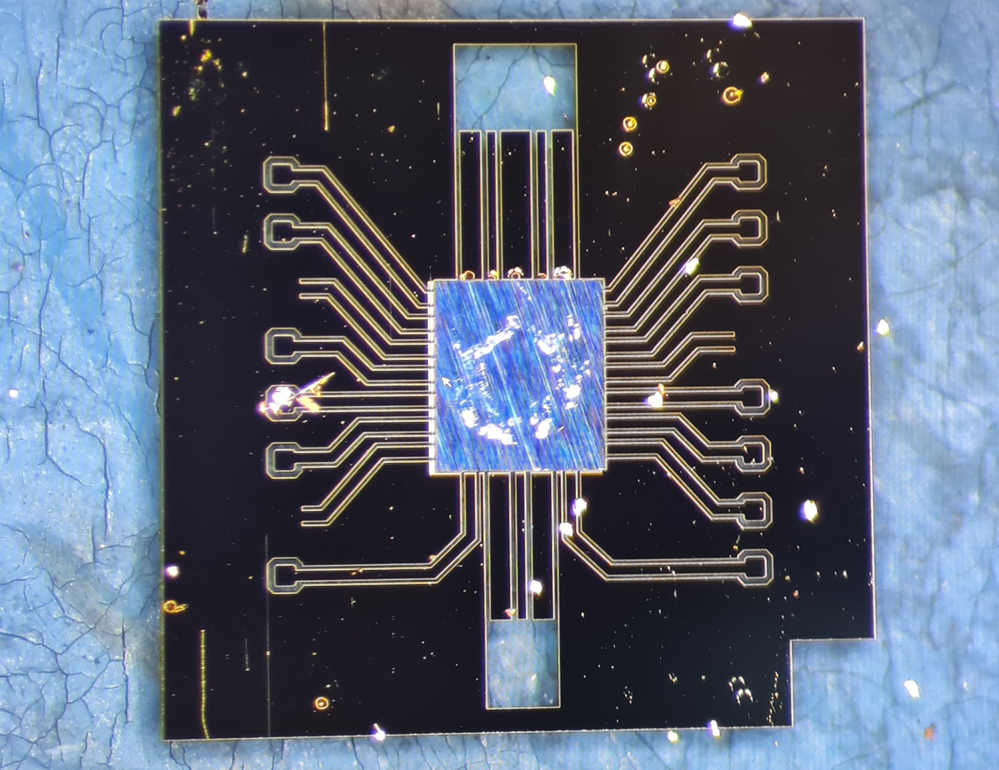
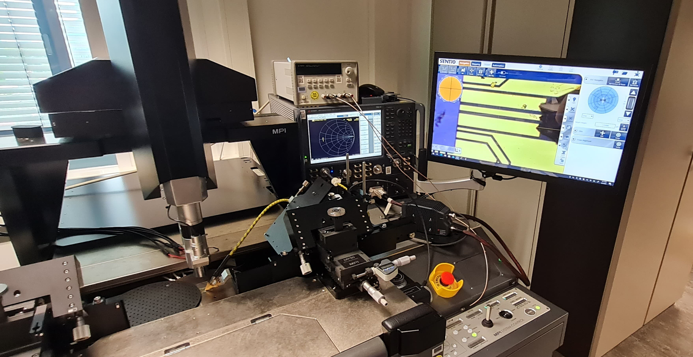
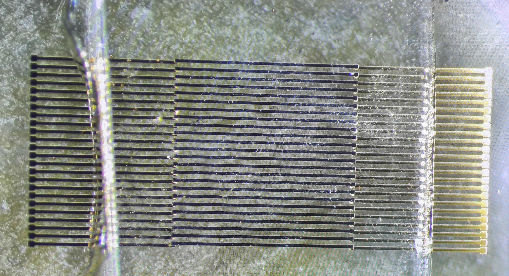
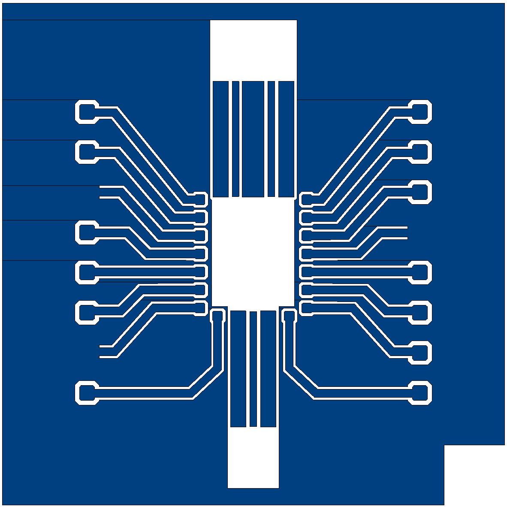
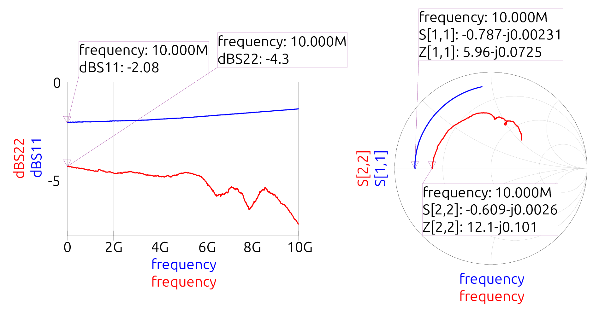
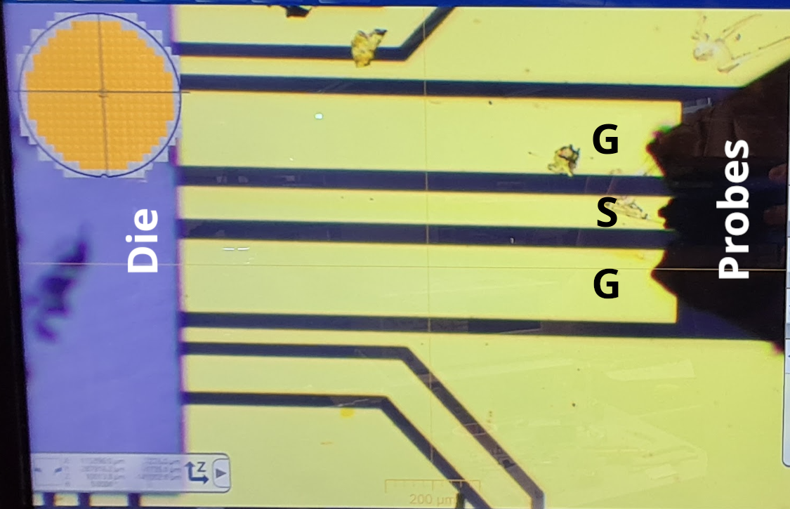
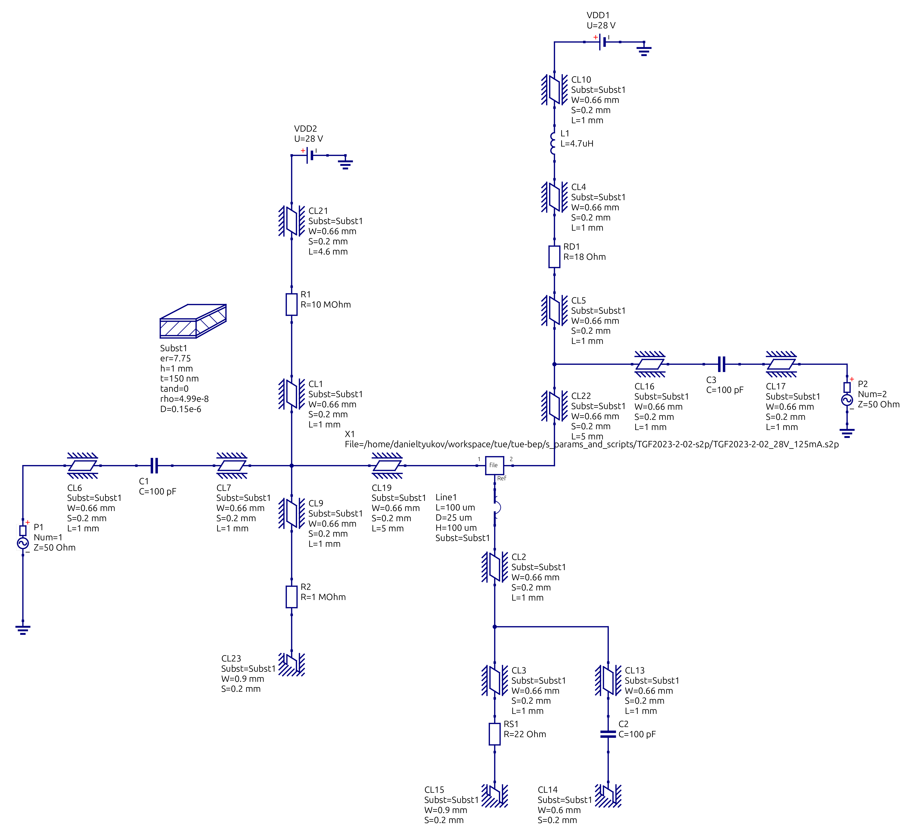

# Development and Characterization of a Gold-Bump Flip-Chip Bonding Process for RF IC Applications




## Project Overview

This Bachelor's End Project (BEP) at TU/e focuses on developing and characterizing a simplified gold-bump flip-chip bonding process for RF integrated circuit applications. The project demonstrates a cost-effective alternative to traditional multilayer metal stacks by using a single-layer Ti/Au Ground-Signal-Ground (GSG) coplanar waveguide interposer on glass substrates.

### Key Innovation
- **Single-layer simplification**: Uses only 50nm Ti/100nm Au metallization instead of complex multilayer stacks
- **Glass substrate**: Low-cost, low-permittivity alternative to expensive ceramic or silicon carriers  
- **Gold stud bumps**: Thermosonic-placed 70μm gold bumps eliminate need for solder and under-bump metallurgy
- **In-house process**: Complete fabrication flow achievable with standard university equipment

## Project Structure

```
📁 tue-bep/
├── 📁 amplifier_die/          # RF amplifier component specifications and data
├── 📁 final_pics_for_paper/   # High-quality images and plots for documentation
├── 📁 interposer_klayouts/    # KLayout design files for interposer masks
├── 📁 qucs_simulations_prj/   # RF circuit simulations and modeling
├── 📁 s_params_and_scripts/   # S-parameter measurements and analysis scripts
├── 📁 rf_die/                 # RF IC die specifications and layouts
├── 📁 references/             # Research papers and technical references
└── 📁 markdown_notes_and_files/ # Project documentation and progress notes
```

## Key Results & Achievements

### 1. Flip-Chip Process Development



Successfully developed a complete flip-chip bonding process:
- Gold stud bump formation using thermosonic wire bonding
- Thermo-compression flip-chip assembly
- High interconnect yield achieved

### 2. RF Characterization & Modeling



Comprehensive RF measurements from 10 MHz to 10 GHz:
- Developed lumped circuit model for gold bump behavior
- Validated π-model for GSG transmission lines on glass
- Created de-embedding methodology for accurate measurements

### 3. Yield Analysis



Achieved high-yield flip-chip assembly:
- Statistical analysis of bond success rates  
- Process parameter optimization
- Damage-free assembly of thin RF dies

## Technical Specifications

### Interposer Design
- **Substrate**: Glass with εᵣ = 7.75
- **Metallization**: 50nm Ti / 100nm Au single layer
- **Trace geometry**: Ground-Signal-Ground coplanar waveguide
- **Impedance**: 50Ω characteristic impedance



### Gold Bump Specifications  
- **Height**: 70μm
- **Formation**: Thermosonic wire bonding process
- **Material**: Pure gold studs
- **Pitch**: Compatible with standard RF IC pad layouts

### RF Performance
- **Frequency range**: 10 MHz - 10 GHz
- **Characteristic impedance**: 49.8Ω (simulated vs measured)
- **Low-frequency behavior**: Simple series resistance model
- **Validated models**: Ready for PDK integration



## Equipment & Facilities

### Fabrication Equipment
- **Thermosonic wire bonder**: For gold stud bump formation
- **Dr. Tresky T-5300**: Flip-chip thermo-compression bonding
- **KLayout**: Mask design and layout verification
- **Clean room facilities**: TU/e Flux lab

### Measurement Setup
- **Vector Network Analyzer (VNA)**: Broadband S-parameter measurements
- **GSG probes**: Ground-Signal-Ground RF probing
- **Microscopy**: Process monitoring and yield analysis



## Simulation & Modeling

### Circuit Simulation
- **QUCS**: RF circuit simulation and modeling
- **Lumped element extraction**: RLC bump models
- **Transmission line modeling**: π-equivalent circuits



### Design Flow
1. **Analytical modeling**: Closed-form equations for CPWG on glass
2. **Circuit simulation**: QUCS-based system modeling  
3. **Layout design**: KLayout mask generation
4. **Fabrication**: In-house processing
5. **Measurement**: VNA-based RF characterization
6. **Model validation**: Simulation vs measurement comparison

## Applications & Impact

### System-in-Package (SiP) Benefits
- **Multi-technology integration**: Combine CMOS, InP, and legacy processes
- **Automotive radar**: High-frequency automotive applications
- **Wireless communication**: Broadband RF systems
- **Cost reduction**: Glass substrate alternative to expensive carriers

### Research Applications
- **Process Design Kit (PDK)**: Validated models for circuit design
- **Prototyping platform**: Cost-effective RF SiP development
- **Educational tool**: Complete flip-chip process demonstration

## Project Team

**Student**: Daniel Tyukov (d.tyukov@student.tue.nl)

**Supervisors**:
- M. Fattori (Primary supervisor)
- G. Radulov  
- T. Matray
- V. Vidojkovic (Technical assistance)
- V. Zaoutis (Technical assistance)

**Institution**: Integrated Circuits Group, Department of Electrical Engineering, Eindhoven University of Technology

**Duration**: February 13, 2025 - June 11, 2025

## Key Publications & Outputs

### Conference Paper
- **Title**: "Development and Characterization of a Gold-Bump Flip-Chip Bonding Process for RF IC Applications"
- **Venue**: SIITME 2025 (submitted)
- **Keywords**: flip-chip bonding, gold stud bumps, Ti/Au CPWG interposer, thermosonic bonding, RF SiP

### Technical Deliverables
- Complete process documentation
- Validated circuit models for PDK integration
- Statistical yield analysis
- Open-source design files and simulation models

## Getting Started

### Prerequisites
- KLayout for mask design
- QUCS for circuit simulation  
- Vector Network Analyzer for measurements
- Access to wire bonding and flip-chip equipment

### Key Files
- `interposer_klayouts/`: Design files for glass interposer masks
- `qucs_simulations_prj/`: Circuit models and simulations
- `s_params_and_scripts/`: Measurement data and analysis
- `final_pics_for_paper/`: Documentation images and plots

### Simulation Flow
1. Open QUCS project files for circuit modeling
2. Review KLayout designs for interposer geometry
3. Analyze S-parameter data for model validation
4. Compare simulation results with measurements

## Future Work

### Process Improvements
- **Bump height optimization**: Investigate different stud geometries
- **Thermal profile tuning**: Optimize thermo-compression parameters
- **Yield enhancement**: Statistical process optimization

### Technology Extensions  
- **Higher frequencies**: Extend characterization beyond 10 GHz
- **Multi-chip assemblies**: Demonstrate SiP integration
- **Alternative substrates**: Investigate silicon and ceramic options
- **Advanced modeling**: Include parasitic effects and nonlinearities

## License & Usage

This project is developed as part of academic research at TU/e. Design files and documentation are provided for educational and research purposes. For commercial applications, please contact the project supervisors.

---

*This project demonstrates the feasibility of cost-effective flip-chip bonding for RF applications using simplified processing and standard university equipment. The validated models and process documentation enable future researchers to build upon this foundation for advanced RF System-in-Package development.*
